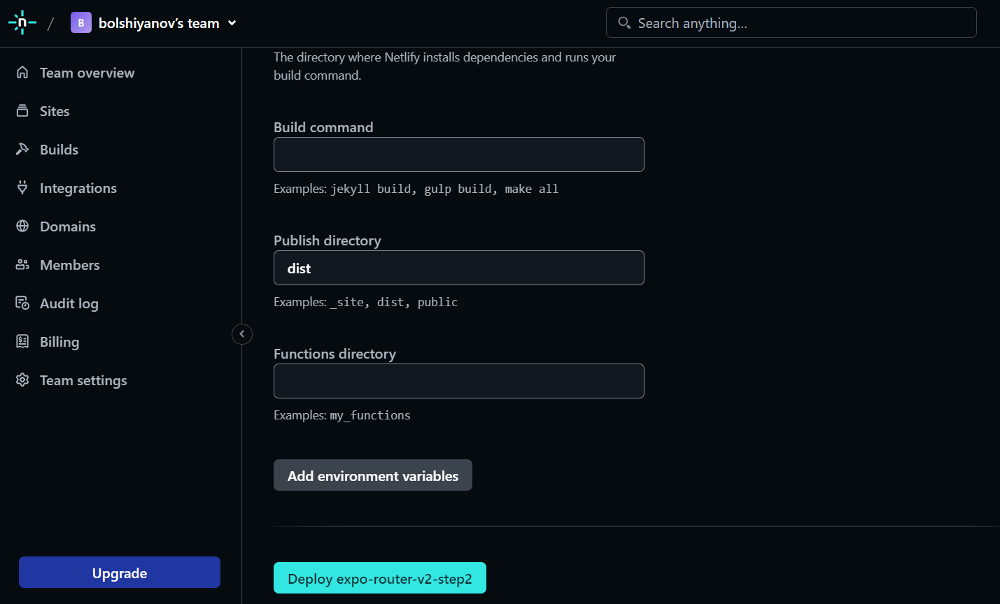
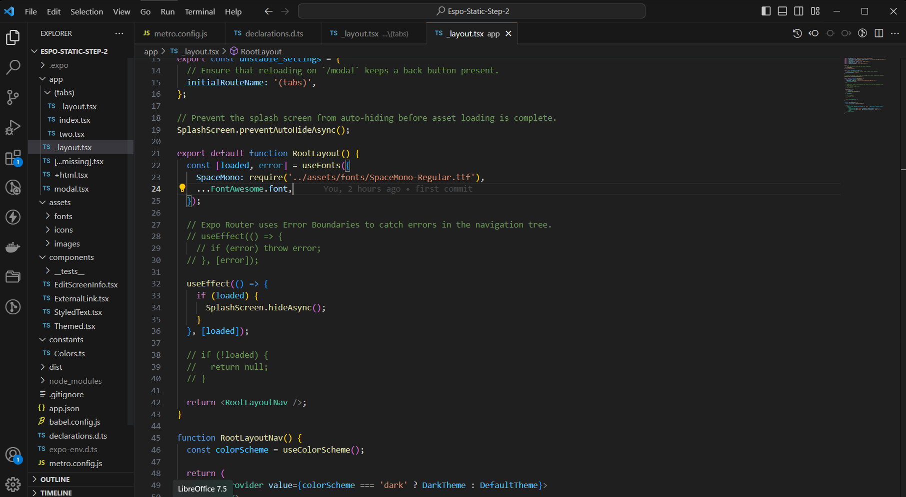
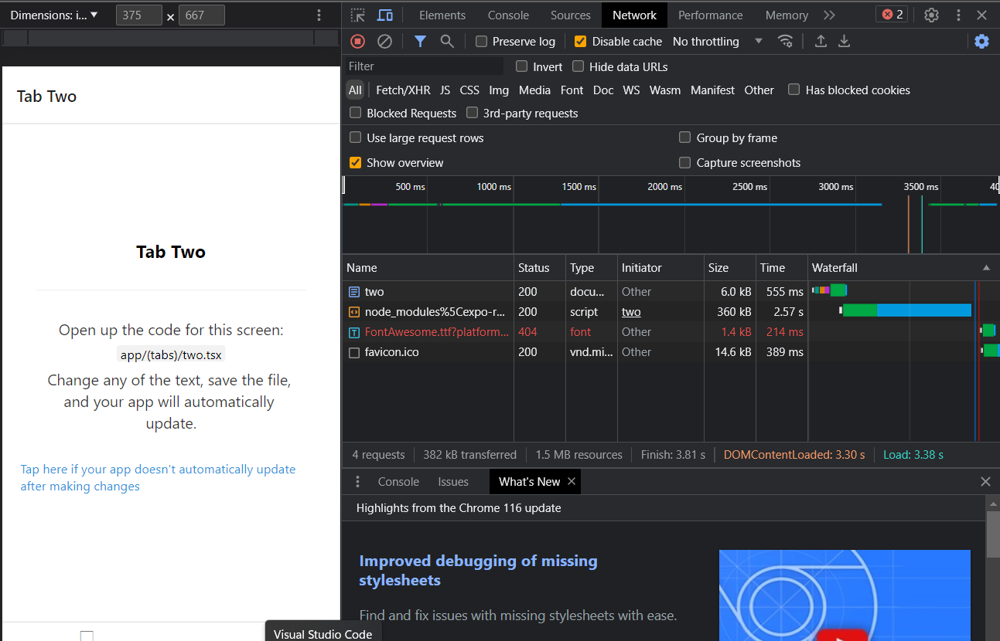
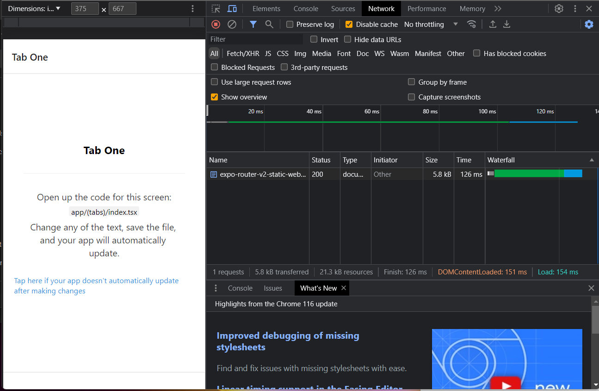
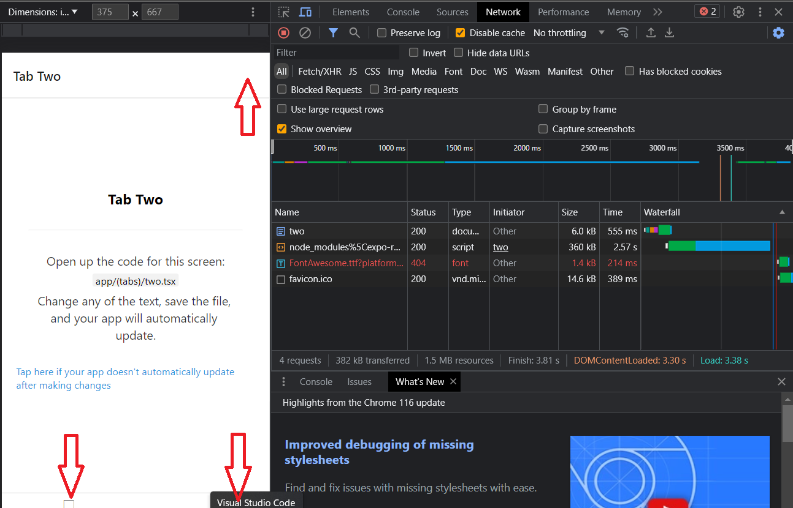

<!-- Banner Image -->

  <a href="https://expo.dev/">
    
    <h1 align="center">Expo Router v2 </h1>
    <h2 align="center">step by step tutorial </h2>
   <h3 We will create an SAP platform for building static websites, as well as a mobile application for iOS and Android for Google and other social networks, like maps.menu  </h3>
<h5 align="center"> <a aria-label="expo documentation" href="https://maps.menu">maps.menu 📚</a></h5>
<
  </a>

  <a aria-label="try expo with snack" href="https://expo-router-v2-static-web-app-step-1.netlify.app/"><b>This 1 step</b></a>
 | <a aria-label="try expo with snack" href="https://expo-router-v2-static-web-app-step-1.netlify.app/"><b>Look web site for 1 step</b></a>
 |
  <a aria-label="expo documentation" href="https://github.com/bolshiyanov/expo-router-v2-step2">Next 2 step 📚</a>

---

- [📚 About this step](#-documentation)
- [🗺 Stack of this step](#-Stack-of-this-step)
- [❓ Your task for this step](#-your-task-for-this-step)
- [🏅 Why expo-router v2](#-Why-expo-router)
- [💙 The Team](#-the-team)
- [License](#license)

<h2 align="center">Empowering Creation: Crafting a Search-Optimized React-Native Website with expo-router v2</h2>

In this tutorial, we embark on a step-by-step journey to construct a static website on React-Native using expo-router v2. Our goal is to build a website builder and mobile app constructor all in one, with maximum search optimization. The project itself spans a considerable scope, encompassing a Multilingual Website Constructor, user registration, payment capabilities, and an array of other features.

In the upcoming chapters, we will establish the foundation of this site's structure and introduce a multitude of navigational possibilities. As we progress, we'll lay the groundwork for seamless navigation and explore the potential for dynamic, user-centric experiences.

## 📚 About this step
Creating a Search-Optimized React-Native Website and App: Your First Dive into expo-router v2

Embark on an exciting journey as we guide you through crafting your grand project – an extensive endeavor designed to encompass essential technologies for aspiring FULL STACK developers. This comprehensive guide offers a step-by-step approach, addressing common challenges while unleashing the potential of expo-router v2. Each obstacle, rather than a hindrance, becomes a stepping stone to enhance your application.

Step-by-Step Guide:

1. Begin by creating a project folder with your chosen title.
2. Open the folder in VSCode's terminal and execute the command: npx create-expo-app@latest --template tabs@49
3. Once prepared, navigate to the project folder and launch it with npm start.

4. If you don't already have the expoGo app, now's the perfect time to install it on your phone. Despite the current project's browser compatibility on your computer, it's essential to have the app for testing. Install the app and open your project on your phone. For those unfamiliar with project structure, a brief video tutorial provides insights into the architecture and navigator functionality.

5. Open your GitHub repository, create a new project, and execute the necessary commands. However, refrain from making a PUSH just yet. Prior to that, we need to export the project.

6. Our project is already equipped with settings to generate a static HTML site during export. Additionally, we can obtain a React SPA, which will prove useful when working with Redux. Pause the project execution and use the command npx expo export -p web in VSCode's console.

<h3 align="left">Problem 1: EXPO-ROUTER v2 </h3>
There may be an error during export, necessitating the installation of the sharp-cli package with npm install sharp-cli. After a successful export, a dist folder emerges at the project root – your inaugural static website.

Or simply start with this template.

7. Avoid rushing to PUSH your code; it serves little purpose for publishing your site. First, open .gitignore at your project's root.

<h3 align="left">Problem 2: EXPO-ROUTER v2</h3>
dist folder, marked as ignored, must be removed from .gitignore.

Now, execute the commands as prompted by GitHub, starting with git init and git add&nbsp;. (note the space between git add and the dot). Follow the subsequent commands in the order specified on GitHub's page.

8. With our project, including the dist folder, now on GitHub, we're ready to publish it on free hosting platforms such as Vercel or Netlify. After logging in, select "ADD A SITE FROM GITHUB." However, take heed: when configuring for publication, avoid selecting any framework. Instead, clear existing settings and add "dist" to PUBLISH DIRECTORY.

Congratulations! Your site is now published.

Chances are your expo-router v2-based static site might not load properly after publication, showing an error message: "SOMETHING WENT WRONG, TRY AGAIN."

My experience led me to discover a solution. Perhaps this issue is resolved now, allowing you to skip the next step. Nevertheless, I had to:

<h3 align="left">Problem 3: EXPO-ROUTER v2</h3>
Comment out the problematic code in /app/_layout.tsx:

Now, re-export and publish.

Hurrah! Your first React-Native static site using expo-router v2 is live.

And by the way, I'm a little more upset than the fact that I find a 360kb script in the browser console on the NETWORK tab. My first thought was this:
An empty page from expo-router already occupies 360 kb, whereas in my full-fledged projects on react, my bundle size is 170 kb ... at first I was sad.

My initial disappointment turned into intrigue. Blocking scripts and refreshing the console reduced the page size to 6KB. This newfound efficiency bolsters my enthusiasm for expo-router v2.

In this iteration, we haven't added the meta tags and other SEO essentials yet, but we'll address those in the future. Currently, three HTML pages exist: two in the "Tab" navigator and one in a modal window.

<h3 align="left">Problem 4: EXPO-ROUTER v2</h3>

We'll tackle this issue in the next step.

Although this problem has been discussed online for some time, Expo developers haven't yet provided a definitive solution. It's hoped that when you engage with this content, the issue will be resolved. Regardless, this challenge isn't all negative. Working with SVG images instead of Expo-vector-icons allows us to expand our app's potential.

Congratulations, you've created your first React-Native static site, or more precisely, React-Native. More details about the site's structure will be covered in a dedicated video for this step.

## ❓ Your task for this step

As you can see, we only have two tabs in the bottomTabsNavigator. Let's add a third tab with the same icon and deploy this project to another free hosting, Vercel.

Here's what you need to do:
1) Create a repository for this step on GitHub, download this repository to your computer.
2) Build the project ['npm install'];
3) Run ['npm start'];
4) Locate in the code of the page ['./(tabs)/_layout.tsx'];
5) Add a ['tabScreen'] code block;
6) Copy and rename the page two.tsx;
7) Check the result;
8) Run ['npx expo export'];
9) Upload the updated project to your GitHub, add integration with Vercel hosting;
10) Check the result on your hosting;
11) Add a star to My repository.

## 🗺 Stack of this step

- [`expo-router-v2`](expo-router-v2) Supported static web generation, css , seo.
- [`expo-router`]( expo-router) There is no specific package called "expo-router." Expo uses React Navigation for routing
- [`expo`](expo) Expo is a platform simplifying React Native development through tools, libraries, and workflow enhancements.
- [`react-dom`](react-dom)React package enabling rendering of components in the web browser's DOM (Document Object Model).
- [`react native`](react-native) JavaScript framework for building cross-platform mobile applications.
- [`react`](react) JavaScript library for building user interfaces, maintained by Facebook and a community.
- [`typescript`](typescript) TypeScript is a superset of JavaScript adding static typing for enhanced code quality and tooling.
- [`gitHub`](gitHub) GitHub is a web-based platform for version control and collaboration using Git.
- [`netlify`](netlify) Netlify is a web hosting platform for deploying and managing modern web projects.

## 🏅 Why expo-router v2

In today's ever-evolving business landscape, the efficacy of customer acquisition and retention holds paramount significance. The juncture where the cost of attracting customers to their initial purchase intersects with the metrics of retention and Life Time Value defines a pivotal point for real-world businesses. It's within this context that businesses often navigate towards the realm of search engine optimization, leveraging the potential to harness organic traffic from giants like Google. 

A website, undoubtedly, serves as a comfortable initial touchpoint between the business and its potential clientele. Yet, its true value is accentuated by the user's willingness to return, thereby fortifying the need for an engaging and compelling platform. However, the second engagement with the customer sets a new objective – that of offering a seamless, native application experience tailored for iPhones and Android devices. Thus, astute businesses strike a harmonious balance by maintaining a static website for search engine visibility and a dynamic mobile application for the app marketplaces. 

Until recently, solutions of such intricate synergy were often reserved for behemoth teams like Twitter, involving an intricate orchestration of web and native components by scores of developers. However, the landscape has witnessed a transformation with the advent of Expo Router Version 2. The paradigm shift has revolutionized the development process, allowing developers to craft code within a single ecosystem and seamlessly export the final product as both a static website and a feature-rich app on the Play Store. 

What's more, the horizon of possibilities has expanded to encompass wearable gadgets, including the likes of the Apple Watch, with Expo Router's extended support. In a matter of minutes, updates can be integrated, revolutionizing the agility with which businesses can iterate their offerings. This presents an unparalleled opportunity to harness the full potential of the internet, propelling businesses toward the realization of their objectives. 

The democratization of such a robust framework is a monumental leap forward. The once formidable barriers that hindered smaller entities from manifesting their digital aspirations have now dissolved. Expo Router ushers in an era of accessibility, granting every entrepreneur and business the tools to bridge the gap between their vision and its realization. As businesses embark on this journey, they are empowered to captivate audiences, foster loyalty, and elevate their digital presence – all while streamlining the development process in ways that were once the domain of the select few. 

In a world where success hinges on the symbiotic relationship between innovation and execution, Expo Router stands as a testament to the power of technology to democratize possibilities. It is an embodiment of the shift that has taken place in the landscape of app and web development – from the complex and unwieldy to the intuitive and efficient. As businesses embrace this evolution, they embark on a transformative trajectory, leaving behind the constraints of the past and venturing into a future where every dream of digital resonance and engagement can be woven into reality. 

## 💙 Author maps.menu v2

Roman Bolshiyanov < status : open for cooperation, look job >

## License

The Expo source code is made available under the [MIT license](LICENSE). Some of the dependencies are licensed differently, with the BSD license, for example.

